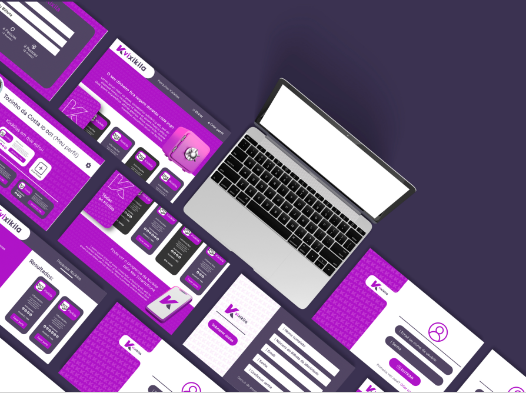

<h1 align=center>

</h1>

<h3 align="center">

💜🤍 VIXIKILA – **Virtual Kixikila**, é uma versão digital e melhorada de um jogo existente na sociedade angolana denominado Kixikila..

</h3>

## **:rocket: OBJETIVO**

O objectivo geral é criar uma versão da **Kixikila convencional mais eficiente**. Isso inclui tornar a Kixikila mais confiável nas transações, garantir que os jogadores recebam o **dinheiro** sempre no momento certo e facilitar a busca de acordo com a necessidade de cada um.💜🤍 
<!-- 
  ...
  Local Reservado para o GIF do projeto rodando.
  ...
-->

## **:computer: TECNOLOGIAS**

#### **Website** ([Html][html] + [Css][css] + [JavaScript][javascript] + [Bootstrap][bootstrap])

  - **[Html][html]**
  - **[Css][css]**
  - **[JavaScript][javascript]**
  - **[Bootstrap][bootstrap]**

  \* Veja o arquivo <kbd>[package.json]()</kbd>

<h3 align="center">
Feito com ❤️ por <a href="#">Vixikila</a>
  

</h3>